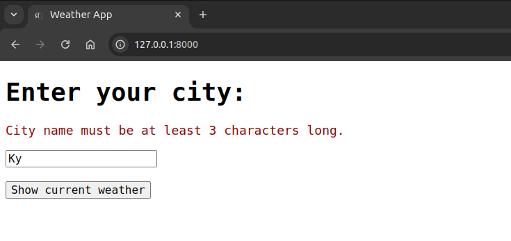
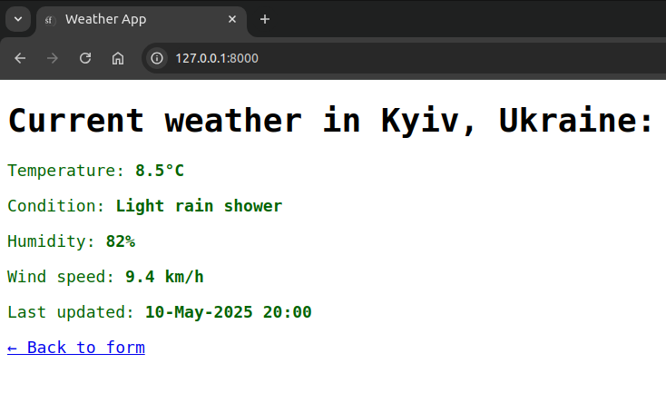

# Weather Application
Application allows getting the current weather in your city.

### Technical Requirements
- Install PHP 8.2 or higher and these PHP extensions (which are installed and enabled by default in most PHP 8 installations): Ctype, iconv, PCRE, Session, SimpleXML, and Tokenizer.
- Install Composer (https://getcomposer.org/download/), which is used to install PHP packages.
- Install Symfony CLI: https://symfony.com/download#step-1-install-symfony-cli

### Usage
- Clone this repository
- Go to the project folder
- Copy `.env.dist` file as `.env` in the project root and update its `APP_SECRET` and `WEATHER_API_KEY` values to the real ones, for weather API sign up on https://www.weatherapi.com/ and get the key on https://www.weatherapi.com/my/
- Run `composer install`
- Run the Symfony server via `symfony server:start` from the project root
- Open http://127.0.0.1:8000/ in your browser
- Enter the city name and click `Show current weather` button

### Screenshots

### Dev notes
- The latest Long-Term Support Release was taken from https://symfony.com/releases for this project, at the moment of this commit it was `6.4.21`, `6.4.x` was used for installation
- Docker is not used here as the app is simple at the moment, no need to use any databases or extra services, so the built-in web server is enough
- Custom logger channel, separate log file and log format is used (custom format logs are written in `var/log/weather_api.log`)
- Custom exception instance is thrown for weather feature (see `\App\Exception\WeatherApiException`)
- Unit tests for the main service are created, to run all the tests use the following CLI command from the project root: `./vendor/bin/phpunit`